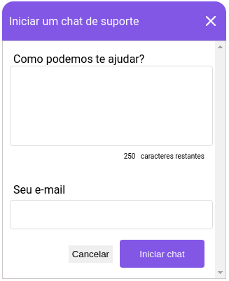

# Simple Chat

<h1 align="center">
    
</h1>
<h1 align="center">
    
</h1>

  <a href="#-technologies">Technologies</a>&nbsp;&nbsp;&nbsp;|&nbsp;&nbsp;&nbsp;
  <a href="#-getting-started">Getting started</a>&nbsp;&nbsp;&nbsp;|&nbsp;&nbsp;&nbsp;
  <a href="#-project">Project</a>&nbsp;&nbsp;&nbsp;|&nbsp;&nbsp;&nbsp;
  <a href="#-routes">Routes</a>&nbsp;&nbsp;&nbsp;|&nbsp;&nbsp;&nbsp;

## 🧪 Technologies

This project was developed using the following technologies:

- [Node.js](https://nodejs.org/)
- [Socket.io](https://socket.io/)
- [TypeORM](https://typeorm.io/)
- [SQlite](https://www.sqlite.org/index.html)
- [TypeScript](https://www.typescriptlang.org/)

## Getting Started

Inside database dir, create the file `database.sqlite`.

Install dependencies

> yarn install

Execute migrations to create the required tables

> yarn typeorm migration:run

Start application

> yarn dev

## Project

Simple chat to join with your application and help your users.

This is a project developed during the **[Next Level Week](https://nextlevelweek.com/)**, presented by **[@Rocketseat](https://github.com/Rocketseat)** during April 19-25, 2021.

## Routes

---

Readme inspired by Guilherme Capitão

